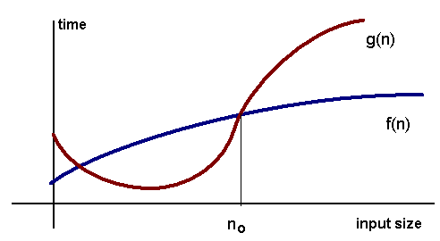

# Complexity Analysis

Complexity Analysis of an algorithm is concerned about how fast or slow a particular algorithm can perform. It can be defined as a numerical function T(n) - time vs. the input size n

## Asymptotic Notations

### 1. Big Oh Notation

For any **monotonic** functions f(n) and g(n) from the positive integers to the positive integers, we say that f(n) = O(g(n)) when there exists constants c > 0 and n0 > 0 such that

> f(n) <= c \* g(n), for all n >= n0

This implies that the function f(n) does not grow faster than g(n), or that function g(n) is **upper bound** for f(n), for all sufficiently n -> infinity

Source: <a href="https://www.cs.cmu.edu/~adamchik/15-121/lectures/Algorithmic%20Complexity/complexity.html">cs.cmu.edu</a>

> Note: Big Oh notation is not symmetric: n = O(n^2) but n^2 != O(n)

#### Some common algorithmic run time complexities

1. Constant time O(1) - Adding an element infront of a linked list
2. Logarithmic O(logn) - Finding an element in a sorted array
3. Linear O(n) - Finding an element in a sorted array
4. Linearithmic O(nlogn) - Merge Sort
5. Quadratic O(n^2) - Shortest path between 2 nodes in a graph
6. Cubic O(n^3) - Matrix Multiplication
7. Exponential O(2^n) - Tower of Hanoi Problem

